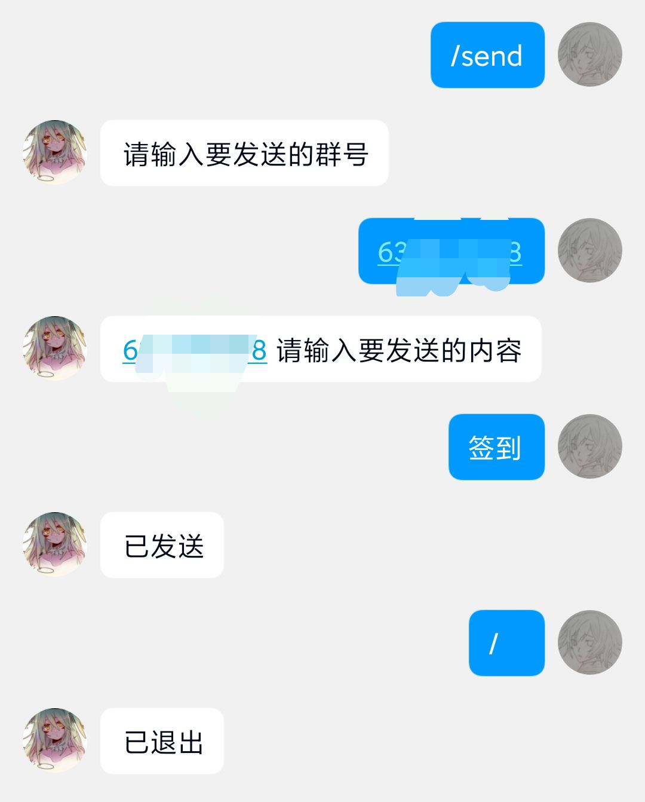

# Puppet-Master

### 通过adminQQ向机器人发送指令远程操控机器人行为。

## 安装

到[Release](https://github.com/AXiX-official/Puppet-Master/releases)下载插件并放入 plugins 文件夹进行安装

安装完毕后，编辑配置文件将adminQQ修改为管理员QQ并重启即可

## 已实现

向指定群组发送消息

## 示例

## 有待实现：
